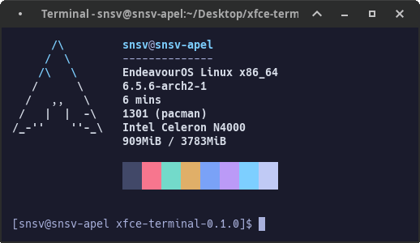
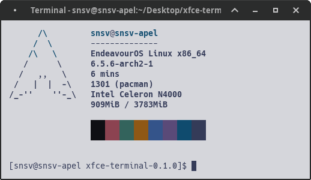

<p align="center">An elegant Tokyo Night (and Light) theme for XFCE Terminal.</p>


<p align="center"></p>
<p align="center"></p>

## Getting started
### Installation
#### Manual
Copy the tokyo_night.theme/tokyo_light.theme file to the local configuration directory `~/.local/share/xfce4/terminal/colorschemes`.

#### Install Script
The included `install_night.sh` and `install_light.sh` shell scripts can be used for an automated installation.  
The installation script was taken from this <a href="https://github.com/nordtheme/xfce-terminal">repo</a>.

To install one of these themes (for example Night) go to file's directory and run command.
```shell
sh install_night.sh 
```

### Activation
  1. Open the *Edit* menu and select *Preferences*
  2. Switch to the *Colors* tab
  3. Select `Nord` from the *Presets* drop-down menu

<br>
<br>
<br>
<p align="center">&copy; 2023 HexyHack</p>